# DIY instructions for [JLCPCB](https://jlcpcb.com/)

**Updated 04/26/2025 - Due to the increased shipping costs and high tariffs currently in place for the USA, this method is currently cost-prohibitive when shipping into the USA. Hopefully this is temporary.**

## Recommended connectors

You'll need to source a 40pin GPIO female header and a 3.50mm 4 position screw terminal and solder them on to complete the board. These are not included with the boards fabricated by JLCPCB when following the instructions below. I recommend sourcing these connectors after you've ordered your boards from JLCPCB

- [40pin GPIO female header - 2x20P 2.54mm pitch](https://a.aliexpress.com/_mOcIEMF)
   
  **^Link above is for a quantity of 10 connectors, double check the quantity and don't order more connectors then you need!**
   
  

- [4 position screw terminal - 3.50mm pitch vertical or right angle](https://a.aliexpress.com/_m0hhCc7)
   
  **^Link above is for a quantity of 5 connectors, double check the quantity and don't order more connectors then you need!**
   
  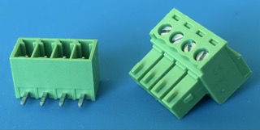

## Ordering process at JLCPCB

1. Login at [https://jlcpcb.com/](https://jlcpcb.com/) (create an account if you don't already have one)
2. Check in the [Coupon center](https://jlcpcb.com/coupon-center) for any SMT coupons you can use to save on your order
    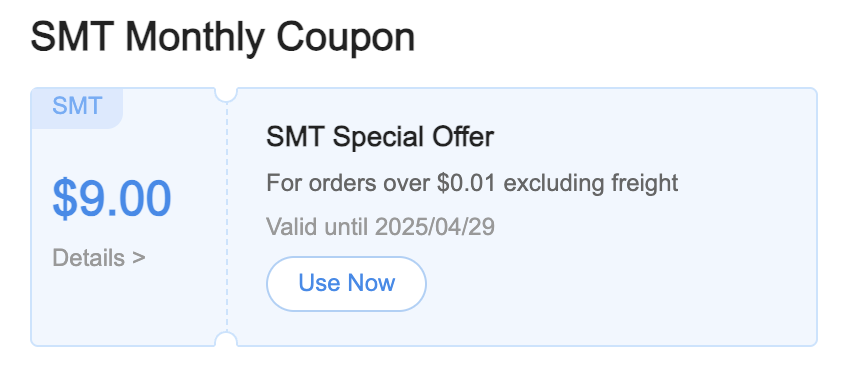
3. Head back to the main [jlcpcb](https://jlcpcb.com/) page and click on _Add gerber file_
    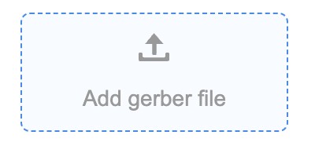
4. Upload the [pi-zero-serial-hat.zip](/KiCAD/fabrication/pi-zero-serial-hat.zip) file located in [/KiCAD/fabrication](/KiCAD/fabrication/)
5. After the upload is processed, scroll down to _PCB Qty_ and choose how many boards you want fabricated
    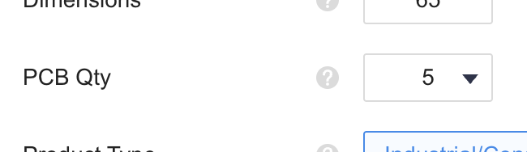
6. Next, scroll down to _PCB color_ and make your selection
    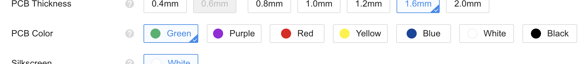
7. I like to remove the order number mark from the pcb but this is optional. If you don't choose to remove the mark, jlcpcb will silkscreen the batch order number on the board in a random location
    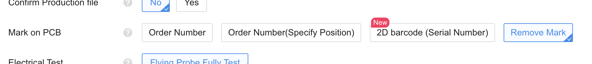
8. Scroll down and enable the PCB Assembly toggle, leave the selection for _Assemble top side_ as is
    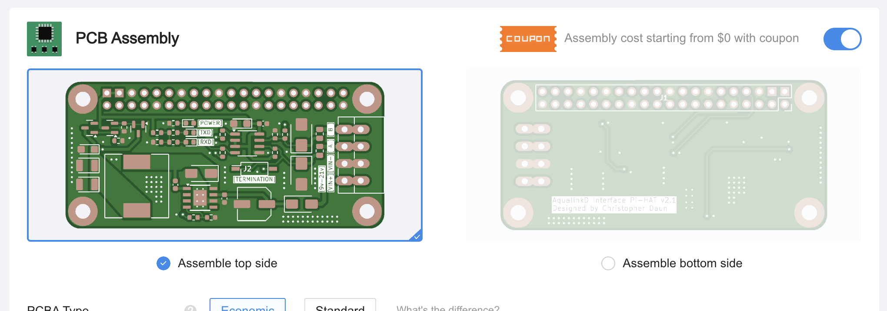
9. Leave the rest of the settings as is and click on the NEXT button
    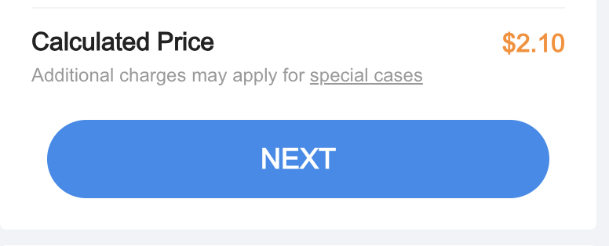
10. Now you'll get a privew of the PCB, click on the next button
     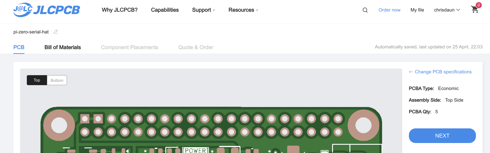
11. Click on the _Add BOM File_ button and upload the [pi-zero-serial-hat.csv](/KiCAD/fabrication/pi-zero-serial-hat.csv) file located in [/KiCAD/fabrication](/KiCAD/fabrication/)
     
12. Click on the _Add CPL File_ button and upload the [pi-zero-serial-hat-all-pos.csv](/KiCAD/fabrication/pi-zero-serial-hat-all-pos.csv) file located in [/KiCAD/fabrication](/KiCAD/fabrication/)
     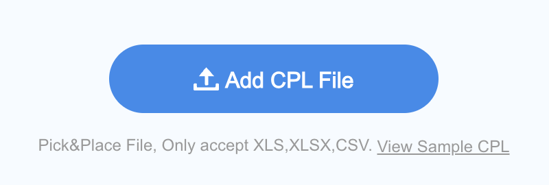
13. Click on the _Process BOM & CPL_ button
     
14. Review the bill of materials parts list. If any parts are out of stock you can search for subsitutes. If everything is in stock, click the _NEXT_ button to move to the next step
     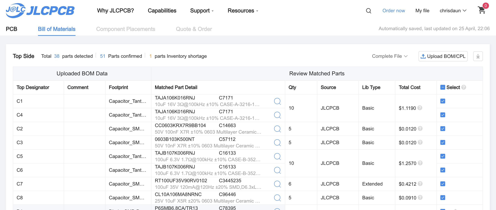

- If you get the warning _Multiple lines in the BOM have been matched to the same part. Please check if the matching is correct_, you can confirm the matching is correct by placing a check in each box with the warning.
   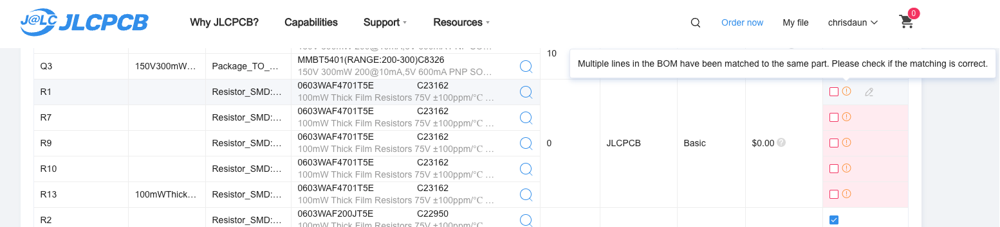

15. On the Compoinent Placement step, you have the chance to confirm the rotation of each part
     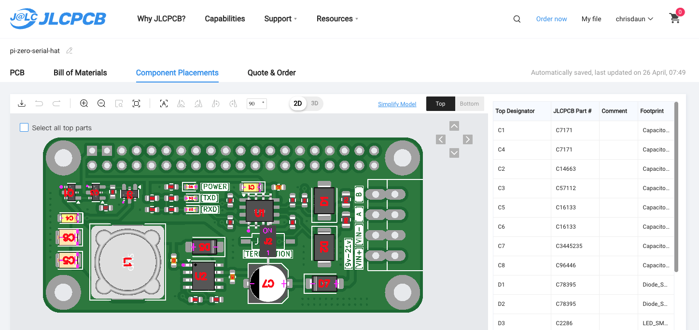
    Due to the way some components are oriented in jlcpcb's component reels, you may need to adjust the component rotation at the interactive board review stage when ordering. You may need to rotate the part at this point until the part's pin 1 designator lines up with the pin 1 designator on the board. This seems to be most common with the following components:

    - U1 - Usually needs to be rotated 90 deg. clockwise
    - Q1, Q2 and Q3 - Usually need to be rotated 180 deg.
    - J2 - This component is a switch and can be rotated 90 deg. either way if needed
    - Use the image below for correct component orientations
       [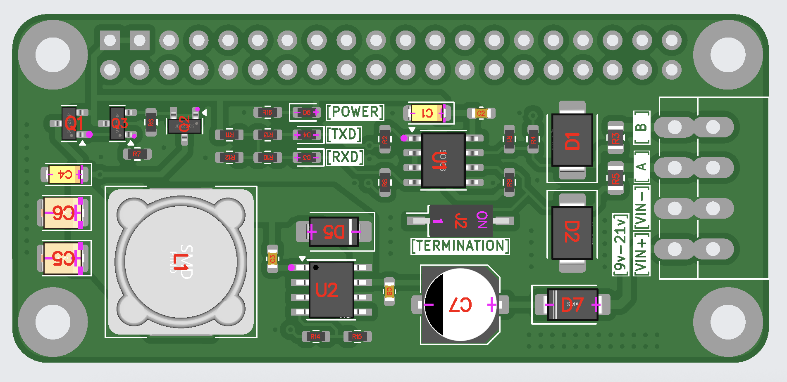](images/jlcpcb/correct_layout.png)

16. Rotate any parts that need it by:

- First selecting the part in the interactive board viewer
- Then clicking on either the _Rotate Right_ or _Rotate Left_ button as many times as needed to align the purple pin 1 dot with the white pin 1 arrow.
- When done, click the _NEXT_ button
   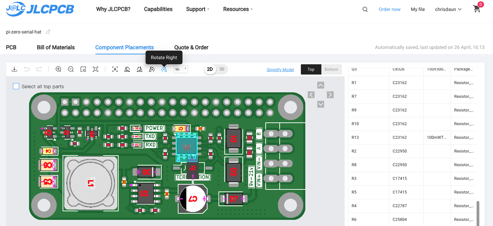

17. Review the price quote, pick a description for the product and click the _SAVE TO CART_ button
     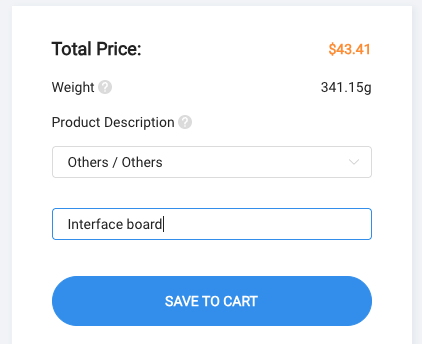
18. Now make sure you select the item you want to purchase, confirm or adjust the quantity you want and click the _Secure Checkout_ button
     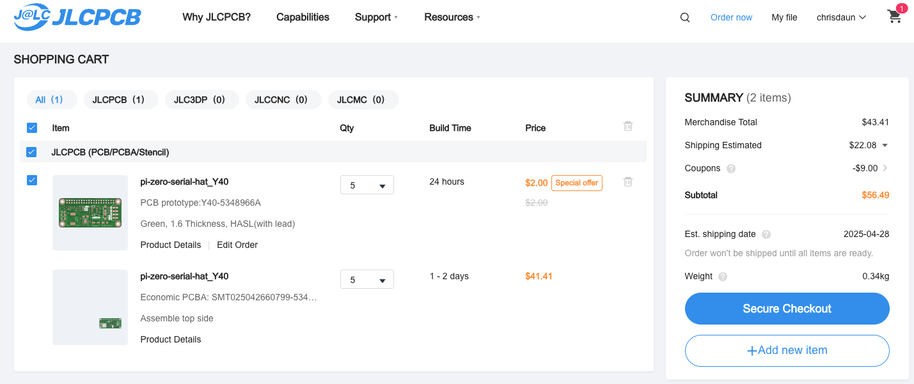
19. Fill out the _Shipping Address, Shipping Method and Payment Method_ sections and make sure to apply any coupons listed in the _Payment Method_ section.
     

**WARNING! You can cancel an order from the [Order History](https://jlcpcb.com/user-center/orders/) page as long as you haven't completed payment. Once you submit a payment the order will move to production within a minute or so and theres no canceling at that point so be sure you really want that order!**

20. Click on the _PAY_ button to complete your order

## Cancel an unpaid order

You can cancel an unpaid order from the [Order History](https://jlcpcb.com/user-center/orders/) page by clicking the _Cancel Order_ text below the orange _Pay_ button, then at the bottom of the page, check the box next to _All (Wxxxxxxxxxxxx)_, then finally click on the blue _Cancel (2)_ button
 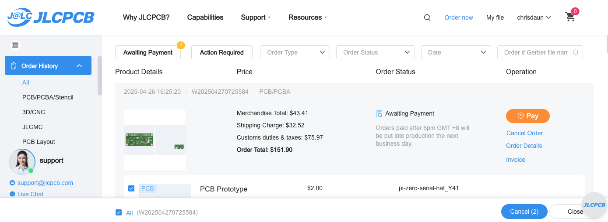
