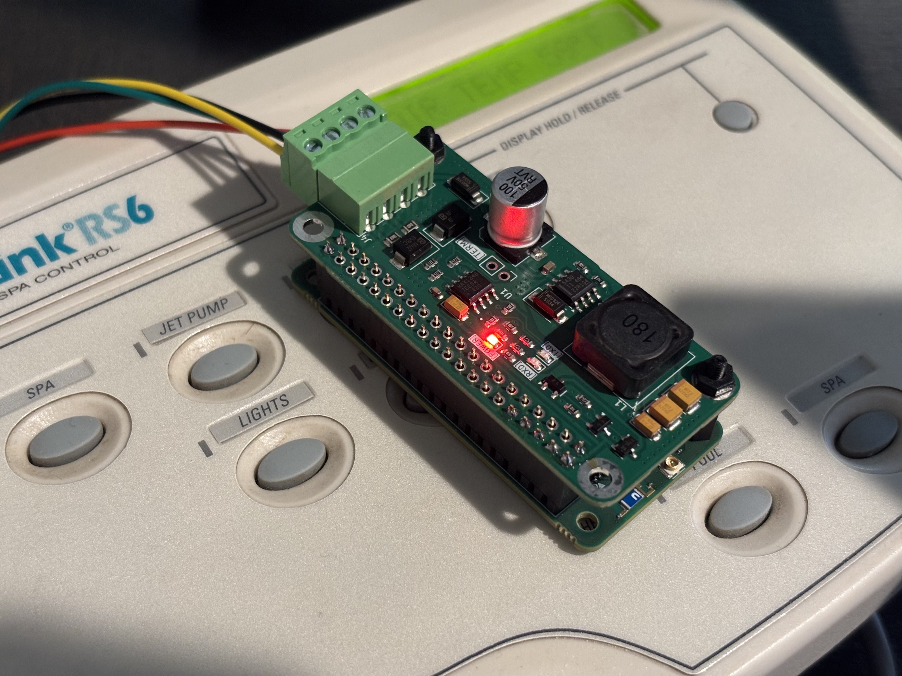
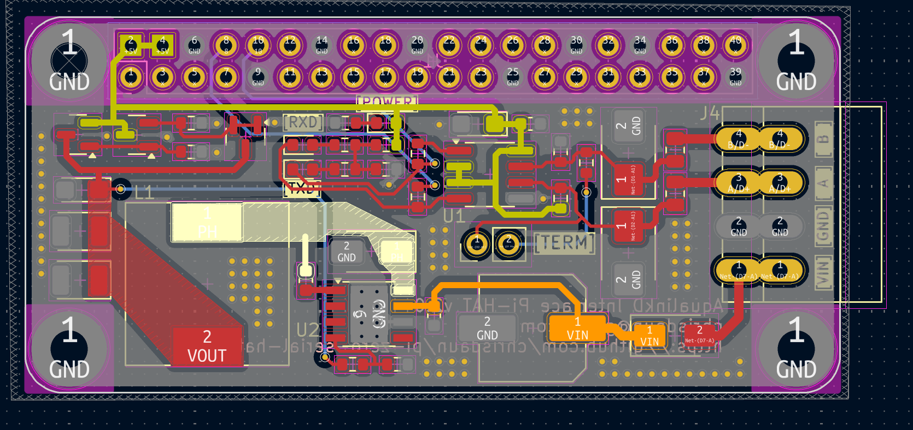
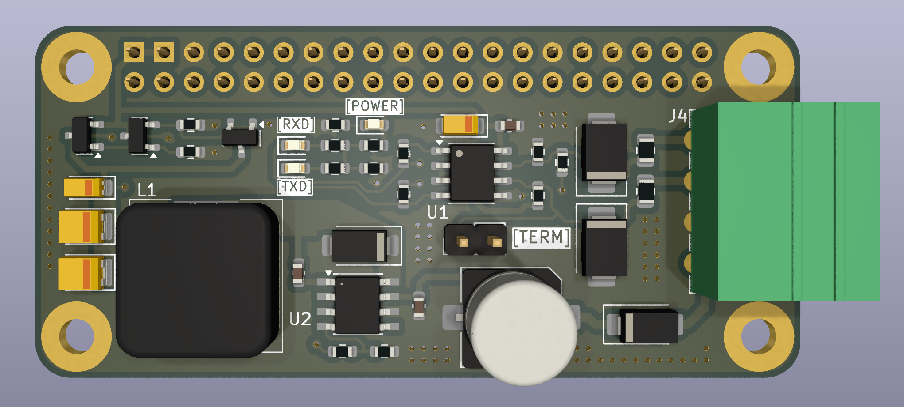
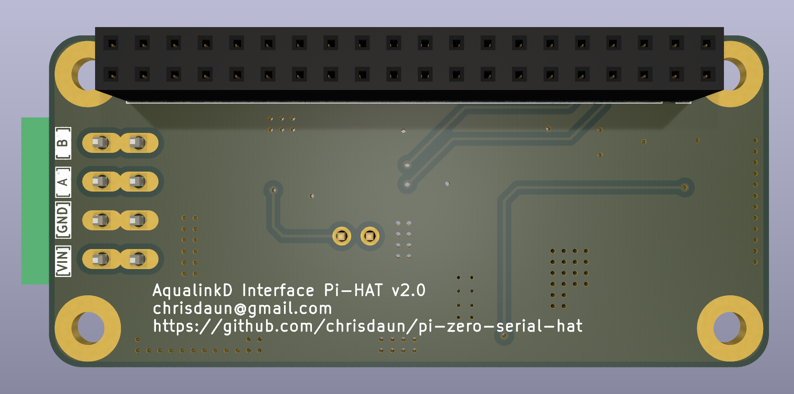

# AqualinkD Interface Pi-HAT v2.0

## What is it?

A Raspberry Pi HAT compatible with Raspberry Pi and similar SBCs
 
It is purpose built for use with AqualinkD and allows you to easily connect an SBC to the Aqualink Serial bus
 
https://github.com/sfeakes/AqualinkD

## Technical stuff

- Communication with the Pi happens over pins 8/10 for TX/RX
- The board can power itself and the connected Pi from the Aqualink Serial bus power.
- The board has the same footprint as a Raspberry Pi Zero but also works on full size Pi boards (Pi 3, 4, 5 etc.)

## Where can I get one?

I may offer premade boards in the future but for now:
 
You can use the files in the KiCAD/fabrication folder to have preassembled boards made at jlcpcb.com
 
You'll need to source a 40pin GPIO female header and a 3.5mm 4 position screw terminal and solder them on to complete the board.

