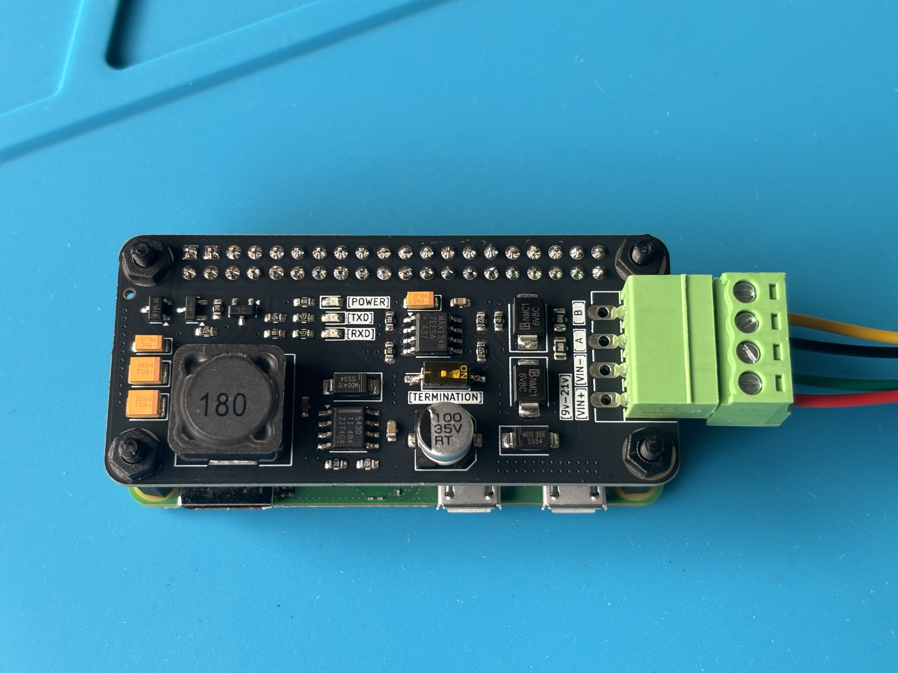
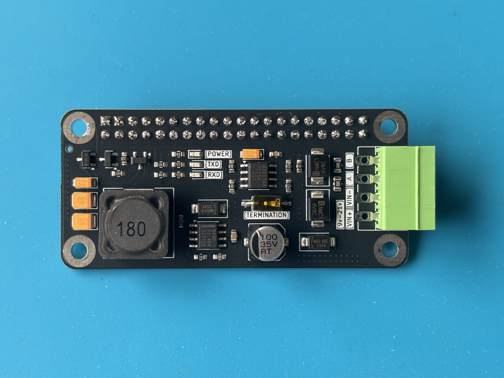
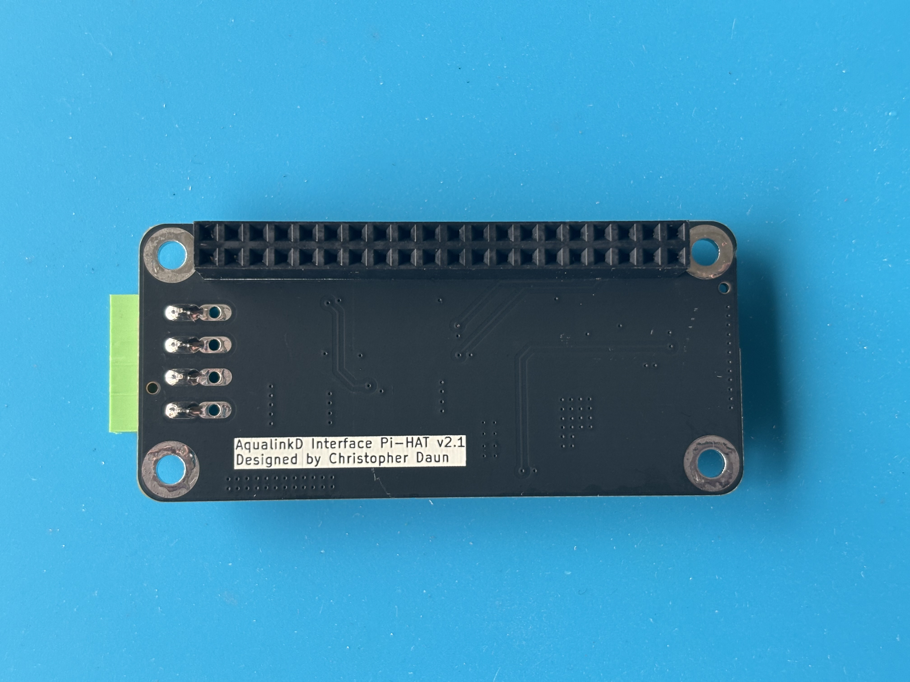

# AqualinkD Interface Pi-HAT

## What is it?

A Raspberry Pi HAT compatible with Raspberry Pi and similar SBCs
 
It is purpose built for use with [AqualinkD](https://github.com/sfeakes/AqualinkD) and allows you to easily connect an SBC to the Aqualink Serial bus

## Technical stuff

- Communication with the Pi happens over pins 8/10 for TX/RX
- If sourcing power from Aqualink's Serial bus, the board can provide 5v power up to 3 amps to power itself and the connected Pi (provided the Serial bus can deliver ~3 amps of current)
- The board has the same footprint as a Raspberry Pi Zero but also works on full size Pi boards like the Pi 3, 4, 5, etc. Usage with boards other then the Pi Zero form factor usually requre a different style connector for the Serial/Power connection. Vertical style connectors with a 3.50mm pin pith work.
- Two sets of 3.50mm mounting holes for the green Serial/Power connector allow for several connector options (horizontal flush/horizontal offset/vertical)

## Where can I get one?

1. Premade boards may available, reach out for more info
2. DIY - Follow the instructions on the [DIY_JLCPCB.md](/DIY_JLCPCB.md) page
    **(Read the update on the top of the linked page about tariff impacts to USA)**

## Software Setup

### Raspberry Pis running Raspbian

1. Run raspi-config with sudo: `sudo raspi-config`
2. Navigate to `Interface Options`
3. Navigate to `Serial Port`
4. Select `No` when asked if you would like a login shell to be accessible over serial **If you skip this step, aqualinkd will not work**
5. Select `Yes` when asked if you would like the serial port hardware enabled
6. Select `Ok`
7. Exit raspi-config
8. Reboot
9. Edit aqualinkd.conf with sudo: `sudo vim /etc/aqualinkd.conf`
10. Set the serial_port variable to use Serial0: `serial_port=/dev/ttyS0`

#### Troubleshooting:

1. You may need to adjust the rs485_frame_delay variable in /etc/aqualinkd.conf. This was not required for my setup but one user reported he needed to set: `rs485_frame_delay=10`

### Raspberry Pis running other OSs/Other Single Board Computers

Some SBCs like the [Orange Pi Zero 2W](http://www.orangepi.org/html/hardWare/computerAndMicrocontrollers/service-and-support/Orange-Pi-Zero-2W.html) and similar have the debug serial console enabled on GPIO pins 8/10 in their images. Serial communication will not work in this configuration and the debug serial console needs to be disabled. This is usually not trivial a varies by SBC so I won't provide guidance on how to do it here.

##

