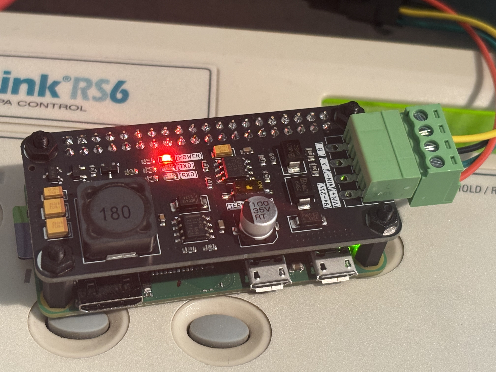
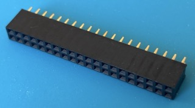
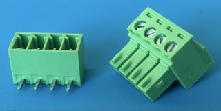
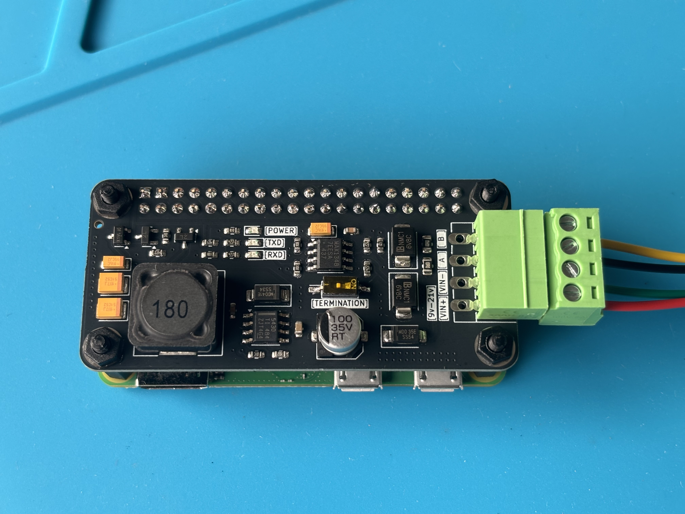
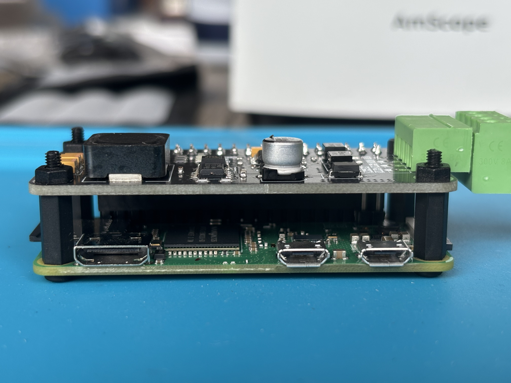
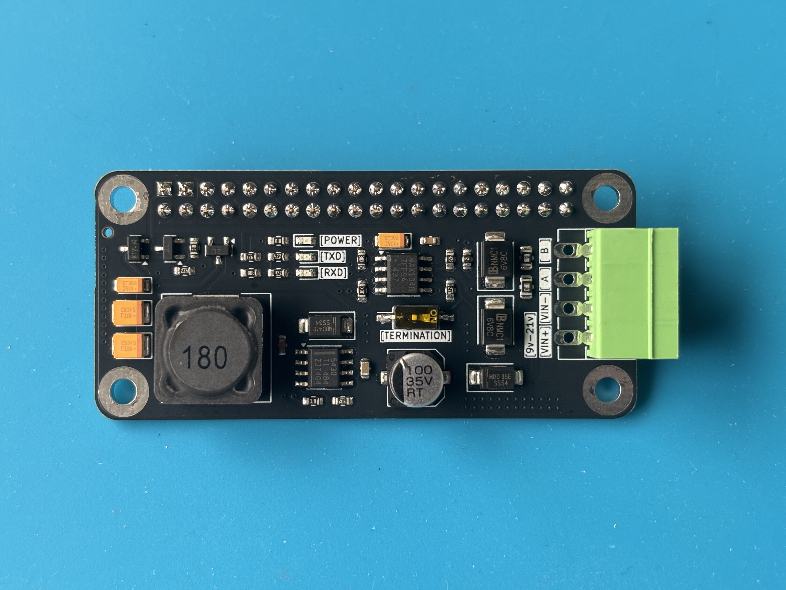
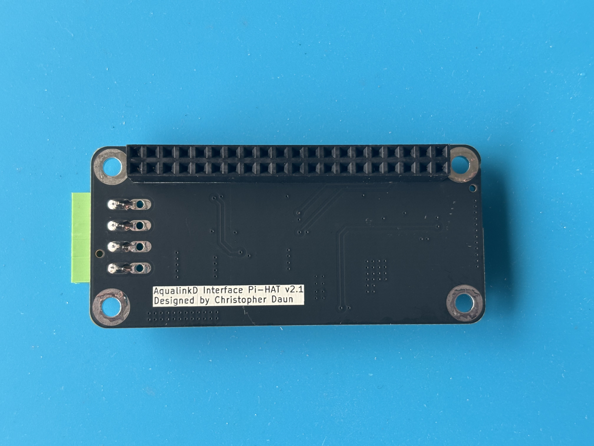

# AqualinkD Interface Pi-HAT

## What is it?

A Raspberry Pi HAT compatible with Raspberry Pi and similar SBCs
 
It is purpose built for use with [AqualinkD](https://github.com/sfeakes/AqualinkD) and allows you to easily connect an SBC to the Aqualink Serial bus

## Technical stuff

- Communication with the Pi happens over pins 8/10 for TX/RX
- The board can power itself and the connected Pi from the Aqualink Serial bus power.
- The board has the same footprint as a Raspberry Pi Zero but also works on full size Pi boards (Pi 3, 4, 5 etc.)
- Two sets of 5.0mm mounting holes for the green Serial/Power connector allow for several connector options (horizontal flush/horizontal offset/vertical)

## Where can I get one?

I may offer premade boards in the future but for now:
 
You can use the files in the KiCAD/fabrication folder to have preassembled boards made at jlcpcb.com
 

Note: Due to the way some components are oriented in jlcpcb's component reels, you may need to adjust the component rotation at the interactive board review stage when ordering. You may need to rotate the part at this point until the part's pin 1 designator lines up with the pin 1 designator on the board. This seems to be most common with the following components:

- U1 - Usually needs to be rotated 90 deg. clockwise
- Q1, Q2 and Q3 - Usually needs to be rotated 180 deg.
- J2 - This component is a switch and can be rotated 90 deg. either way if needed

You'll need to source a 40pin GPIO female header and a 3.50mm 4 position screw terminal and solder them on to complete the board.

- [40pin GPIO female header - 2x20P 2.54mm pitch](https://a.aliexpress.com/_mOcIEMF)
   
  

- [4 position screw terminal - 3.50mm pitch vertical or right angle](https://a.aliexpress.com/_m0hhCc7)
   
  

## Software Setup

### Raspberry Pis running Raspbian

1. Run raspi-config with sudo: `sudo raspi-config`
2. Navigate to `Interface Options`
3. Navigate to `Serial Port`
4. Select `No` when asked if you would like a login shell to be accessible over serial **If you skip this step, aqualinkd will not work**
5. Select `Yes` when asked if you would like the serial port hardware enabled
6. Select `Ok`
7. Exit raspi-config
8. Reboot
9. Edit aqualinkd.conf with sudo: `sudo vim /etc/aqualinkd.conf`
10. Set the serial_port variable to use Serial0: `serial_port=/dev/ttyS0`

### Raspberry Pis running other OSs/Other Single Board Computers

Some SBCs like the [Orange Pi Zero 2W](http://www.orangepi.org/html/hardWare/computerAndMicrocontrollers/service-and-support/Orange-Pi-Zero-2W.html) and similar have the debug serial console enabled on GPIO pins 8/10 in their images. Serial communication will not work in this configuration and the debug serial console needs to be disabled. This is usually not trivial a varies by SBC so I won't provide guidance on how to do it here.

##

